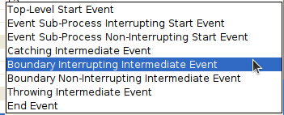
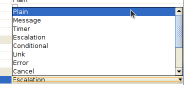
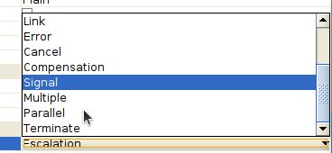
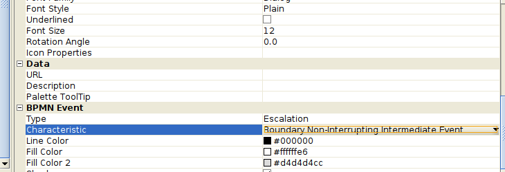
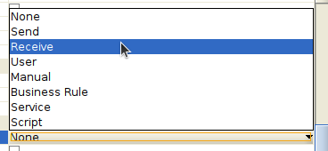
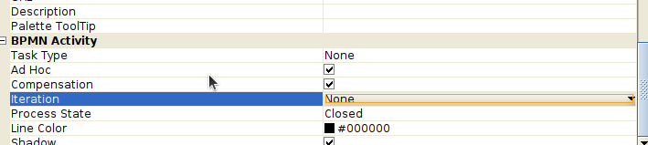
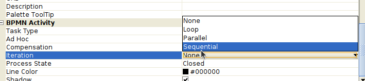
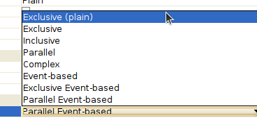

<!-- yed: 
type
characteristic (bound. non-interrupt intermediate event)

event characteristic

type 1

type 2

 -->

<!-- intermediate event
event

    start
        top-level (none, message, timer, conditional, signal, multiple, parallel multiple)
        event sub-process interrupting (message, timer, escalation, conditional, error, compensation, signal, multiple, parallel multiple)
        event sub-process non-interrupting (message, timer, escalation, conditional, signal, multiple, parallel multiple)
    intermediate
        catching (message, timer, conditional, link, signal, multiple, parallel multiple)
        boundary interrupting (message, timer, escalation, conditional, error, cancel, compensation, signal, multiple, parallel multiple)
        boundary non-interrupting (message, timer, escalation, conditional, signal, multiple, parallel multiple, terminate)
        throwing (none, message, escalation, link, compensation, signal, multiple, parallel multiple)
    end (none, message, escalation, error, cancel, compensation, signal, multiple, terminate) -->

    task (atomic)
    choreography task
        collapsed choreography sub-process
        expanded choreography sub-process
    process/sub-process (nonatomic)
        collapsed sub-process
        expanded sub-process

bmpn activity

task type

iteration

'activity': 
'task-type' ['None', 'Send', 'Receive', 'User', 'Manual', 'Business Rule', 'Service', 'Script'], 'None'
'iteration' ['none', 'loop', 'parallel', 'sequential'], 'none'
'ad hoc'
'compensation'

'activity': {
    'task-type': 
    'task-types': ['None', 'Send', 'Receive', 'User', 'Manual', 'Business Rule', 'Service', 'Script'], 'None'
    'iteration': ['none'],
    'iteration-types': ['none', 'loop', 'parallel', 'sequential'],
    'ad hoc': ['true', 'false'],
    'compensation': ['true', 'false'],
}

<!-- 
gateway-complex.svg
gateway-eventbased.svg
gateway-none.svg
gateway-or.svg
gateway-parallel.svg
gateway-xor.svg

map image to id: -->

<!-- 

' ', 'x', '0', '*', 'e', 'ee', 'pe'

    exclusive decision and merging. both data-based and event-based. exclusive can be shown with or without the "x" marker.
    inclusive gateway decision and merging
    complex gateway – complex conditions and situations
    parallel gateway – forking and joining
 -->

sequence flow 	- стрелки, ассоциации

    normal flow
    uncontrolled flow
    conditional flow
    default flow
    exception flow
message flow 	message flow
association 	association

группы

pool 	pool
lane 	lane 

<!-- 
data object

'annotation', 'group', 'data store', 'request message', 'reply message' -->

    collection
    data input
    data output

other

    looping
    activity looping
    sequence flow looping
    multiple instances
    process break
    transactions
    nested/embedded sub-process
    off-page connector
    compensation association
    communication (subcommunication)
    communication link