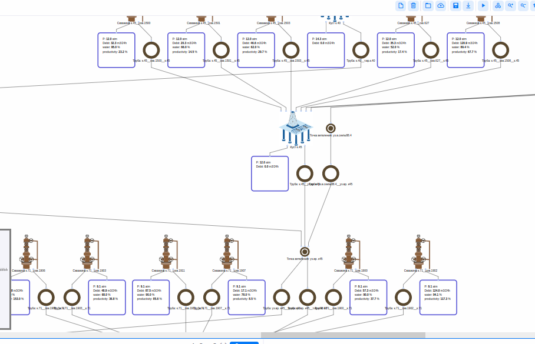
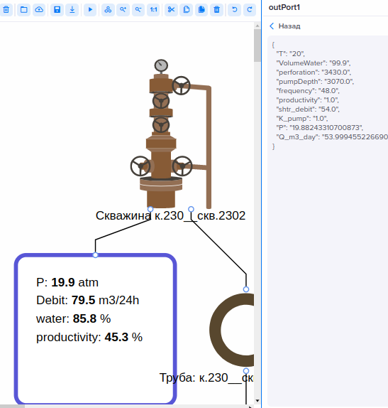
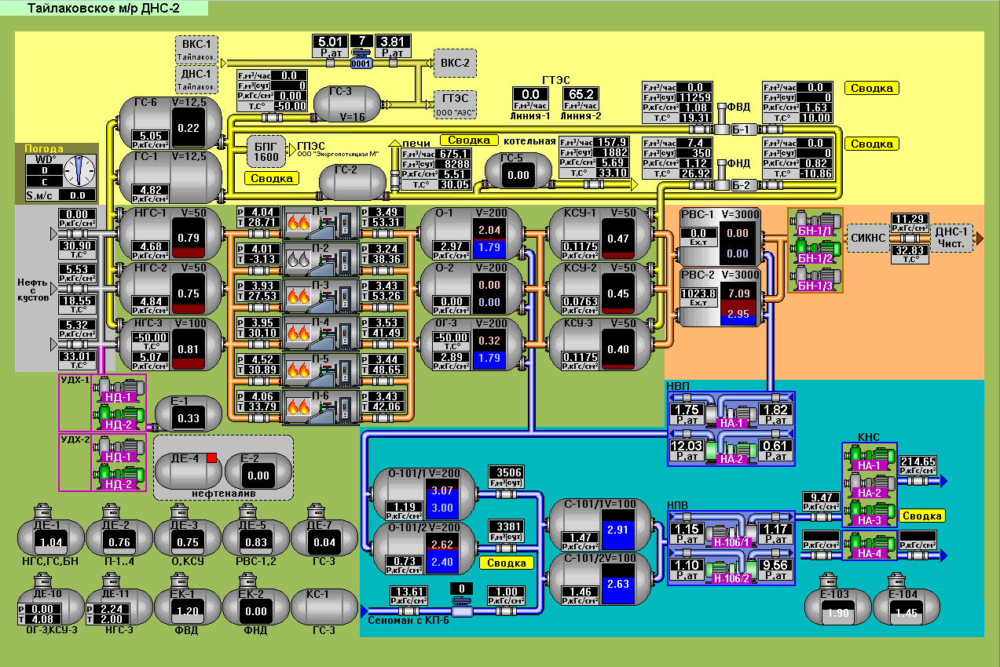

# oil primitives



## img

all icons + icons for edges

## indicator

indicator primitives used in schemes

## other

some src-s

## primitives

raw-primitives

NOTE: 
expected sending props from prim to indicator node

out_port >> props {"P": "100", ....} >> indicator



no config in primitives.
expected as in risk primitives, 
sources are available:::

list of props to send via indication port:

* in example graph 'well/src/demo_graph/demo_3_corr_ids_dns3_all_wells_Q_fixed_last.json'
* ports demo '/home/user/git/datacad-primitives/well/src/ports/well_outPort.json'


## edges

expected 4-5 types of colored edges

(icon& examplem provided) in 'well/src/img'

referring to area scheme & colors



expected as in electrical primities === colored edges, direction indication arrow if possible

```js
oil_edge_fluid.svg
oil_edge_gas.svg
oil_edge_oil.svg
oil_edge_reagent.svg
oil_edge_water.svg
oil_edge_whatif.svg
```