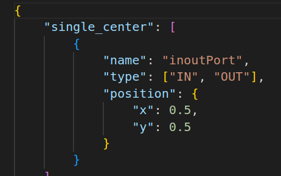

# config

ports config

well_primitives.csv ["ports"] >> ports config

to implement:
* 'pair_vertical_directed_indication'
* 'pair_vertical_directed'
* 'single_center'

props::

files in folder props
